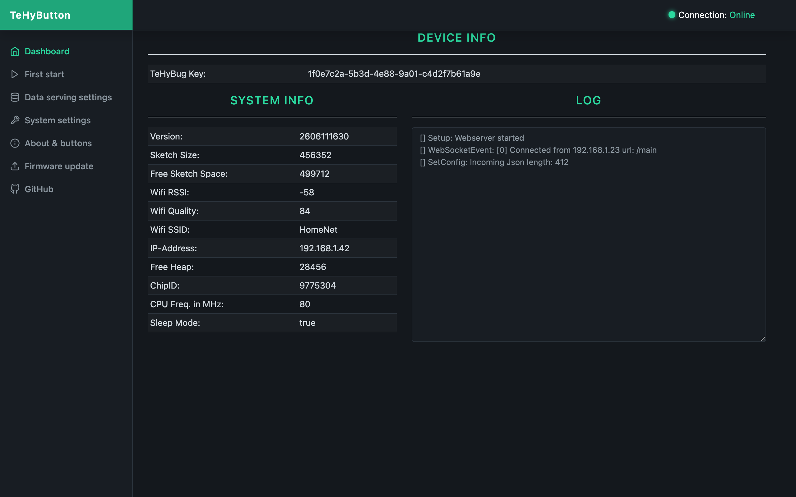
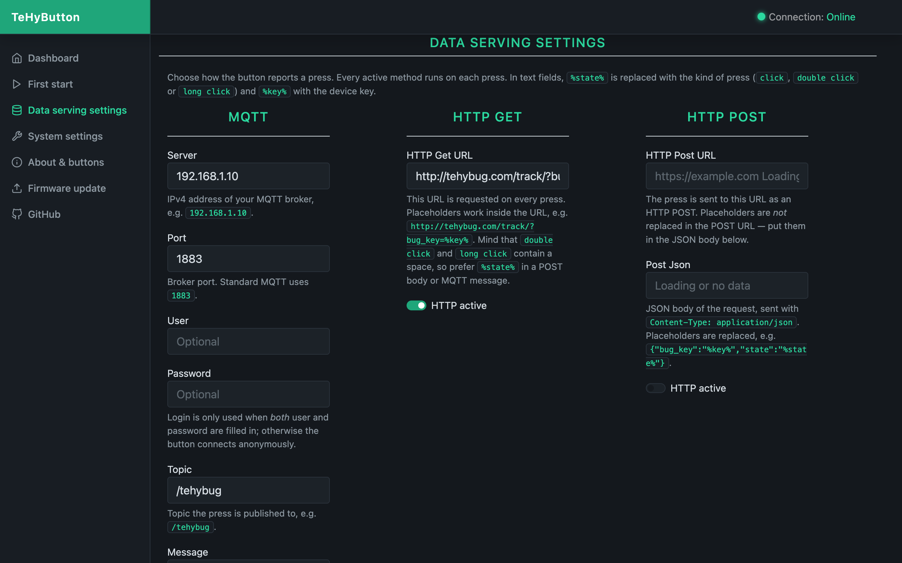
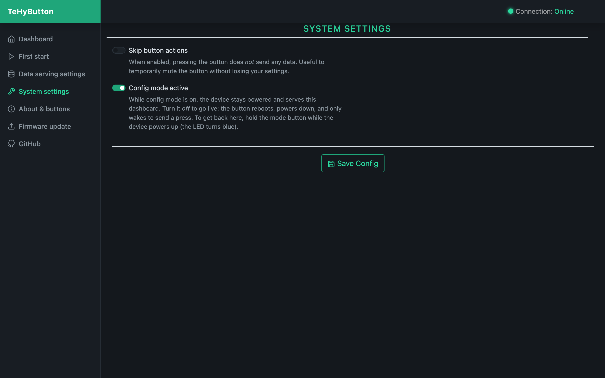
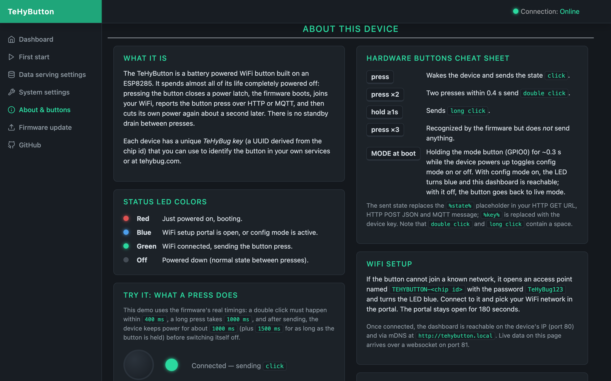
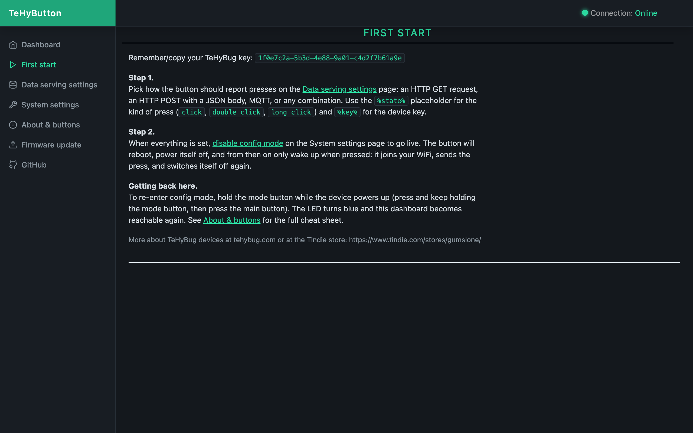

# TeHyButton

A battery powered, latching WiFi button on an ESP8285. Pressing the button
powers the device on, it joins your WiFi, reports the press (HTTP GET,
HTTP POST and/or MQTT) and cuts its own power again — no standby drain
between presses.

- single click, double click and long press are reported as
  `click` / `double click` / `long click` via the `%state%` placeholder
- each device has a unique key (`%key%` placeholder), usable with
  [tehybug.com](https://tehybug.com) or your own service
- WiFi setup through a captive portal, configuration through a built-in
  web dashboard, firmware updates over the air

## Dashboard



## Data serving settings



## System settings



## About & buttons cheat sheet



## First start



## Building

```sh
./build.sh            # release build (DEBUG=0) for esp8285 + generic
./build.sh debug      # debug build with serial logging (-DDEBUG=1)
./build.sh all        # both
```

Binaries land in `build/<board>/<mode>/`; the release esp8285 binary also
refreshes the shipped `tehybutton.ino.esp8285.bin`. Requires
[arduino-cli](https://arduino.github.io/arduino-cli/) with the
`esp8266:esp8266` core (2.7.4) installed.

## Web UI development

The dashboard pages under `tehybutton/v1/` are served from tehybug.com and
loaded by the device's embedded start page. To preview them locally with
simulated device data:

```sh
php -S 127.0.0.1:8123 -t tehybutton/v1
# open http://127.0.0.1:8123/preview.html            (dashboard)
# open http://127.0.0.1:8123/preview.html?page=about (any other page)
```

`preview.html` stubs the device websocket and feeds realistic sample data
through the UI's real message handling, so all pages render without
hardware. The README screenshots are captured from exactly this harness:

```sh
"Google Chrome" --headless=new --screenshot=docs/screenshots/main.png \
  --window-size=1280,800 --force-device-scale-factor=2 \
  --virtual-time-budget=12000 --hide-scrollbars \
  "http://127.0.0.1:8123/preview.html?page=main"
```
